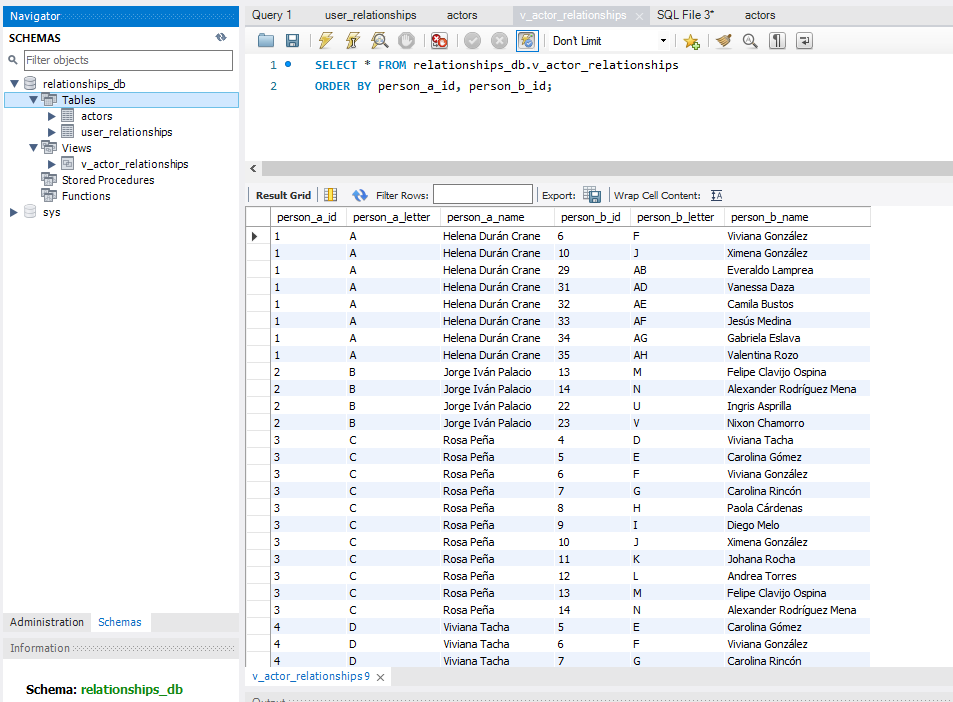

# Pipeline de Datos de Relaciones con Dagster

## Descripción del Proyecto

Este proyecto implementa un pipeline de datos ETL (Extracción, Transformación y Carga) utilizando **Dagster** para cumplir con la prueba técnica de Data Engineer Manager.

El objetivo es procesar una matriz de relaciones entre personas, proporcionada en un archivo Excel, y cargarla en una base de datos MySQL. El pipeline está diseñado para ser robusto y automatizado, ejecutándose diariamente para reflejar las actualizaciones enviadas por el equipo de datos.

El proceso se puede resumir en los siguientes pasos:

1. **Extracción:** Lee los datos de dos hojas de un archivo `relaciones.xlsx`: una matriz de adyacencia y una lista de actores.
2. **Transformación:** Limpia y procesa los datos para convertirlos en tablas relacionales normalizadas. La lógica está diseñada para ser resiliente a inconsistencias comunes en archivos Excel, como filas vacías, datos dispersos o no contiguos.
3. **Carga:** Carga los datos limpios en tablas (`user_relationships`, `actors`) en una base de datos MySQL. Adicionalmente, crea una vista (`v_actor_relationships`) para facilitar la consulta de los datos de forma legible.
4. **Orquestación:** Todo el proceso está orquestado por Dagster, con una programación para ejecutarse cada 24 horas.

## Arquitectura y Tecnologías Utilizadas

- **Orquestador de Pipeline:** Dagster
- **Contenerización:** Docker & Docker Compose
- **Base de Datos:** MySQL 8.0
- **Lenguaje de Programación:** Python 3.9
- **Librerías Clave:** Pandas, NumPy, SQLAlchemy

## 🚀 Setup y Ejecución

Sigue estos pasos para configurar y ejecutar el pipeline de ETL en tu entorno local.

### Prerrequisitos

- Docker y Docker Compose instalados.

### 1. Configuración del Entorno

Este proyecto utiliza variables de entorno para gestionar las credenciales de la base de datos.

#### Crear archivo de entorno

Copia el archivo de ejemplo `.env.example` a un nuevo archivo llamado `.env`. Este archivo `.env` será utilizado por Docker Compose pero está excluido de Git por seguridad.

```bash
# En Linux o macOS
cp .env.example .env

# En Windows (Command Prompt o PowerShell)
copy .env.example .env
```

#### Editar el archivo `.env`

Abre tu nuevo archivo `.env` y reemplaza los valores de ejemplo con tus propias credenciales para la base de datos.

### 2. Levantar los Servicios

Una vez que tu archivo `.env` esté configurado, puedes levantar todos los servicios usando Docker Compose.

```bash
# Este comando construirá las imágenes y levantará los contenedores.
docker-compose up --build
```

### 3. Ejecutar el Pipeline en Dagster

Tras una ejecución exitosa de `docker-compose up`, sigue estos pasos en la interfaz de Dagster:

#### Acceder a la Interfaz Web

Abre tu navegador y ve a [http://localhost:3000](http://localhost:3000). Verás el grafo de assets que define las dependencias del pipeline.


#### Materializar los Datos

Para ejecutar el pipeline completo, haz clic en el botón "View lineage" en la esquina superior derecha. Esto te llevará a ver el global asset lineage, después da click en "Materialize all" en la esquina superior derecha.


#### Monitorear la Ejecución

Da click en la pestaña "Runs", esquina superior izquierda, donde podrás ver el progreso de la ejecución en tiempo real. Cada asset se ejecutará como un paso, y se volverá verde al completarse con éxito.


#### Verificar el Resultado en la Base de Datos

Una vez que la ejecución haya finalizado, los datos estarán en tu base de datos MySQL. Puedes conectarte con tu cliente SQL preferido (DBeaver, MySQL Workbench, etc.) y ejecutar una consulta para verificar los resultados. La vista `v_actor_relationships` es ideal para una revisión legible.

```sql
SELECT * FROM relationships_db.v_actor_relationships
ORDER BY person_a_id, person_b_id;
```



## 🔍 Notas de Diseño y Decisiones Importantes

Para asegurar la robustez del pipeline, se tomaron varias decisiones clave:

### 1. El Desafío de Usar Excel como Fuente de Datos

Los archivos Excel son una fuente de datos notoriamente frágil. Algunos de los problemas identificados y mitigados fueron:

- **Datos Dispersos:** El pipeline está diseñado para manejar escenarios donde se añaden datos de forma no contigua (ej., se añade información para el ID 25 sin tener datos para los IDs 19-24).
- **Filas/Columnas Vacías:** La lógica de lectura ignora las filas y columnas completamente en blanco, que a menudo actúan como terminadores prematuros en librerías como Pandas.
- **Inconsistencias de Tipo:** Todo el bloque de datos de la matriz se convierte a un tipo numérico uniforme para evitar errores de comparación (1.0 vs 1 vs "1").

### 2. Decisión de Usar IDs Numéricos como Clave Principal

Durante el desarrollo, se identificó una inconsistencia en los códigos de letra utilizados como identificadores en la matriz. Para evitar esta fragilidad, se decidió utilizar los IDs numéricos como la única fuente de verdad para las relaciones. El pipeline usa la primera columna numérica de la matriz como el índice maestro, asegurando que la matriz de adyacencia sea siempre cuadrada y coherente.

### 3. Estructura de la Base de Datos

El pipeline crea dos tablas principales y una vista:

- **`actors`:** Almacena la relación entre el ID numérico, el código de letra y el nombre del actor.
- **`user_relationships`:** Almacena los pares de IDs que tienen una relación.
- **`v_actor_relationships`:** Una vista que une las dos tablas anteriores para presentar una visión legible de las relaciones.

## 🌟 Punto Opcional y Mejoras Futuras

- **Validación de Datos:** Se exploró la implementación de Dagster Asset Checks para validar la calidad de los datos (ej., unicidad de IDs). Aunque se encontró un problema de versionado con el entorno Docker local, esta sigue siendo la mejora más recomendada para un entorno de producción.
- **Sensor de Archivos:** Se podría implementar un Sensor en Dagster que detecte automáticamente la actualización del archivo `relaciones.xlsx` y lance el pipeline, en lugar de depender únicamente de una ejecución programada.