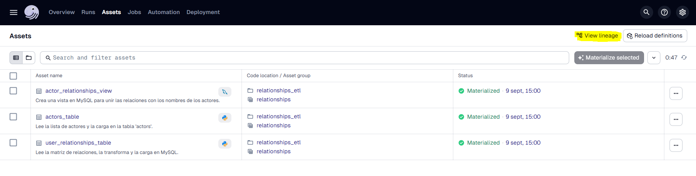
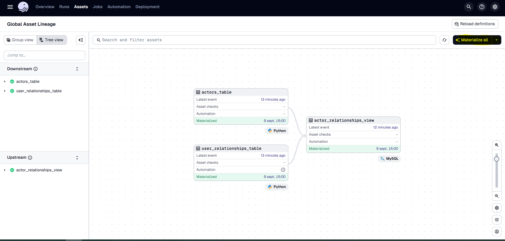
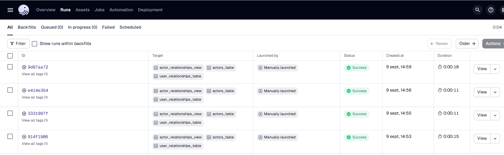
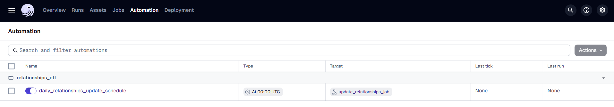

# Pipeline de Datos de Relaciones con Dagster

## Descripción del Proyecto

Este proyecto implementa un pipeline de datos ETL (Extracción, Transformación y Carga) utilizando **Dagster** para cumplir con la prueba técnica de Data Engineer Manager.

El objetivo es procesar una matriz de relaciones entre personas, proporcionada en un archivo Excel, y cargarla en una base de datos MySQL. El pipeline está diseñado para ser robusto y automatizado, ejecutándose diariamente para reflejar las actualizaciones enviadas por el equipo de datos.

El proceso se puede resumir en los siguientes pasos:

1. **Extracción:** Lee los datos de dos hojas de un archivo `relaciones.xlsx`: una matriz de adyacencia y una lista de actores. **Asegurate de que el archivo tenga el nombre correcto**
2. **Transformación:** Limpia y procesa los datos para convertirlos en tablas relacionales normalizadas. La lógica está diseñada para ser resiliente a inconsistencias comunes en archivos Excel, como filas vacías, datos dispersos o no contiguos.
3. **Carga:** Carga los datos limpios en tablas (`user_relationships`, `actors`) en una base de datos MySQL. Adicionalmente, crea una vista (`v_actor_relationships`) para facilitar la consulta de los datos de forma legible.
4. **Orquestación:** Todo el proceso está orquestado por Dagster, con una programación para ejecutarse cada 24 horas.

## Arquitectura y Tecnologías Utilizadas

- **Orquestador de Pipeline:** Dagster
- **Contenerización:** Docker & Docker Compose
- **Base de Datos:** MySQL 8.0
- **Lenguaje de Programación:** Python 3.9
- **Librerías Clave:** Pandas, NumPy, SQLAlchemy

## Querys utilizados para generar DB y tablas
*Nota: Los links llevan a las lineas donde se implementan

1. [Creación de **user_relationships**](https://github.com/eugenioge3/the-palace-company-challenge/blob/15eede17cb8b4f0feb23fa9ef3a4ca8e20dedc2d/exercise_1_etl_pipeline/project_etl/assets.py#L17-L23)
```sql
    CREATE TABLE IF NOT EXISTS user_relationships (
        person_a INT NOT NULL,
        person_b INT NOT NULL,
        updated_at TIMESTAMP DEFAULT CURRENT_TIMESTAMP ON UPDATE CURRENT_TIMESTAMP,
        PRIMARY KEY (person_a, person_b);
```

2. [Creación de **actors**](https://github.com/eugenioge3/the-palace-company-challenge/blob/15eede17cb8b4f0feb23fa9ef3a4ca8e20dedc2d/exercise_1_etl_pipeline/project_etl/assets.py#L99-L105)
```sql
    CREATE TABLE IF NOT EXISTS actors (
        numeric_id INT PRIMARY KEY NOT NULL,
        letter_code VARCHAR(5) NOT NULL,
        actor_name VARCHAR(255) NOT NULL,
        updated_at TIMESTAMP DEFAULT CURRENT_TIMESTAMP ON UPDATE CURRENT_TIMESTAMP;
```
3. [Creación de Vista **v_actor_relationship**](https://github.com/eugenioge3/the-palace-company-challenge/blob/15eede17cb8b4f0feb23fa9ef3a4ca8e20dedc2d/exercise_1_etl_pipeline/project_etl/assets.py#L166-L179)
```sql
    CREATE OR REPLACE VIEW v_actor_relationships AS
    SELECT
        ur.person_a AS person_a_id,
        act_a.letter_code AS person_a_letter,
        act_a.actor_name AS person_a_name,
        ur.person_b AS person_b_id,
        act_b.letter_code AS person_b_letter,
        act_b.actor_name AS person_b_name
    FROM
        user_relationships ur
    JOIN
        actors act_a ON ur.person_a = act_a.numeric_id
    JOIN
        actors act_b ON ur.person_b = act_b.numeric_id;
```


## Código Base

1. Lectura de Excel

- 1.1 [user_relationships](https://github.com/eugenioge3/the-palace-company-challenge/blob/15eede17cb8b4f0feb23fa9ef3a4ca8e20dedc2d/exercise_1_etl_pipeline/project_etl/assets.py#L35)
```python
    excel_path = "/opt/dagster/app/data/relaciones.xlsx"
    sheet_name = "Matriz de adyacencia"
    df_raw = pd.read_excel(excel_path, sheet_name=sheet_name, header=None)
```

- 1.2 [actors](https://github.com/eugenioge3/the-palace-company-challenge/blob/15eede17cb8b4f0feb23fa9ef3a4ca8e20dedc2d/exercise_1_etl_pipeline/project_etl/assets.py#L116-L122)
```python
    excel_path = "/opt/dagster/app/data/relaciones.xlsx"
    sheet_name = "Lista de actores"
    df = pd.read_excel(excel_path, sheet_name=sheet_name, header=None, skiprows=4, usecols="A:C")
```

2. Organización de Datos
 - 2.1 [user_relationships](https://github.com/eugenioge3/the-palace-company-challenge/blob/15eede17cb8b4f0feb23fa9ef3a4ca8e20dedc2d/exercise_1_etl_pipeline/project_etl/assets.py#L37-L55)
```python
        # Extrae la lista de todos los IDs numéricos válidos de la primera columna (columna A).
        all_ids = pd.to_numeric(df_raw.iloc[2:, 0], errors='coerce').dropna().astype(int)

        # Extrae solo el bloque de datos numéricos (desde la celda C3 en adelante).
        data_block = df_raw.iloc[2:, 2:].copy()
        
        # Crea una matriz cuadrada vacía, usando all_ids para el índice y las columnas.
        df_matrix = pd.DataFrame(index=all_ids, columns=all_ids)
        
        # Rellena la matriz cuadrada con los datos del Excel.
        # Recorta los datos y los índices para que coincidan en tamaño
        valid_rows = all_ids[:len(data_block)]
        valid_cols = all_ids[:len(data_block.columns)]
        
        # Asigna los datos a la subsección correspondiente de la matriz cuadrada.
        df_matrix.loc[valid_rows, valid_cols] = data_block.values

        # Convierte toda la matriz a tipo numérico para estandarizarla.
        df_matrix = df_matrix.apply(pd.to_numeric, errors='coerce')
```

 - 2.2 [actors](https://github.com/eugenioge3/the-palace-company-challenge/blob/15eede17cb8b4f0feb23fa9ef3a4ca8e20dedc2d/exercise_1_etl_pipeline/project_etl/assets.py#L123-L132)
```python
         # Nombramos las columnas
        df.columns = ["letter_code", "numeric_id", "actor_name"]
        
        # Limpieza de datos
        df.dropna(how="all", inplace=True) # Eliminar filas completamente vacías
        df['numeric_id'] = df['numeric_id'].astype(int) # Asegurar que el ID es un número entero

        # Convierte todos los códigos a mayúsculas para asegurar consistencia
        df['letter_code'] = df['letter_code'].str.upper()
        context.log.info("Se estandarizaron los 'letter_code' a mayúsculas.")
```


3. Carga a MySQL [user_relationships](https://github.com/eugenioge3/the-palace-company-challenge/blob/15eede17cb8b4f0feb23fa9ef3a4ca8e20dedc2d/exercise_1_etl_pipeline/project_etl/assets.py#L78-L83) -  [actors](https://github.com/eugenioge3/the-palace-company-challenge/blob/15eede17cb8b4f0feb23fa9ef3a4ca8e20dedc2d/exercise_1_etl_pipeline/project_etl/assets.py#L140-L145)

```python
    with engine.connect() as conn:
        with conn.begin():
            conn.execute(text(f"TRUNCATE TABLE {table_name}"))
            if not final_df.empty:
                final_df.to_sql(table_name, con=conn, if_exists="append", index=False)
            context.log.info(f"Tabla '{table_name}' actualizada con {len(final_df)} registros.")
```
 - Utilizamos TRUNCATE por que es más rápido que DELETE FROM, TRUNCATE reinicia la tabla completa.

## Setup y Ejecución

Sigue estos pasos para configurar y ejecutar el pipeline de ETL en tu entorno local.

### Prerrequisitos

- Docker y Docker Compose instalados.
   (**El servicio de Docker Desktop debe estar corriendo**)

### 1. Configuración del Entorno

Este proyecto incluye un archivo .env que incluye variables de entorno para gestionar las credenciales de la base de datos. 
**Exponer un archivo .env con credenciales no es buena practica de seguridad** sin embargo, por practicidad se decidió dejar este archivo.
Algunas alternativas de gestión de credenciales como GitHub Secrets o AWS Secrets Manager.

### 2. Levantar los Servicios

Podemos levantar todos los servicios usando Docker Compose.

**Navega hasta la raíz de este proyecto**, el directorio `exercise_1_etl_pipeline`. Todos los comandos deben ejecutarse desde esta ubicación.


```bash
# Este comando construirá las imágenes y levantará los contenedores.
docker-compose up --build
```

### 3. Ejecutar el Pipeline en Dagster

Tras una ejecución exitosa de `docker-compose up`, sigue estos pasos en la interfaz de Dagster:

#### Acceder a la Interfaz Web

Abre tu navegador y ve a [http://localhost:3000](http://localhost:3000). Verás el grafo de assets que define las dependencias del pipeline.

#### Materializar los Datos

Para ejecutar el pipeline completo, ve a "Assets" en la parte superior, después haz clic en el botón "View lineage" en la esquina superior derecha. Esto te llevará a ver el global asset lineage. 



Da click en "Materialize all" en la esquina superior derecha.



#### Monitorear la Ejecución

Da click en la pestaña "Runs", esquina superior izquierda, donde podrás ver el progreso de la ejecución en tiempo real. Cada asset se ejecutará como un paso, y se volverá verde al completarse con éxito.



#### Verificar el Resultado en la Base de Datos

Una vez que la ejecución haya finalizado, los datos estarán en tu base de datos MySQL. Puedes conectarte con tu cliente SQL preferido (DBeaver, MySQL Workbench, etc.) y ejecutar una consulta para verificar los resultados. La vista `v_actor_relationships` es ideal para una revisión legible.

1. Abrir MySQL Workbench: Inicia la aplicación. En la pantalla de bienvenida, haz clic en el icono + junto a "MySQL Connections" para crear una nueva conexión.
2. Configurar la Conexión: Rellena los campos del formulario con los siguientes datos exactos:
- Connection Name: Dagster Test Project (o cualquier nombre que prefieras).
- Hostname: 127.0.0.1
- Port: 3307
- Username: root
3. Probar la Conexión: Haz clic en el botón "Test Connection". Te pedirá la contraseña.
- Introduce la contraseña: password
- Puedes marcar la casilla "Save password in vault" para no tener que escribirla de nuevo.
- Deberías ver una ventana emergente que dice "Successfully made the MySQL connection". Haz clic en "OK".
4. Guardar y Abrir la Conexión: Haz clic en "OK" en la ventana de configuración para guardar la conexión. Ahora aparecerá en tu pantalla de inicio. Haz doble clic en ella para abrir el editor de SQL.
5. Ejecutar la Query de Verificación: En la ventana del editor de SQL, escribe y ejecuta la siguiente consulta para ver los datos cargados por el pipeline:


```sql
SELECT * FROM relationships_db.v_actor_relationships
ORDER BY person_a_id, person_b_id;
```

## Schedule

Para activar la ejecución automática cada 24 horas:

1. Ve a la pestaña "Schedules" en la interfaz de Dagster
2. Busca "daily_relationships_etl"
3. Activa el toggle para habilitar la ejecución automática
4. El pipeline se ejecutará diariamente a las 0:00 hrs UTC



## Notas de Diseño y Decisiones Importantes

Para asegurar la robustez del pipeline, se tomaron varias decisiones clave:

### 1. El Desafío de Usar Excel como Fuente de Datos

Los archivos Excel son una fuente de datos notoriamente frágil. Algunos de los problemas identificados y mitigados fueron:

- **Datos Dispersos:** El pipeline está diseñado para manejar escenarios donde se añaden datos de forma no contigua (ej., se añade información para el ID 25 sin tener datos para los IDs 19-24).
- **Filas/Columnas Vacías:** La lógica de lectura ignora las filas y columnas completamente en blanco, que a menudo actúan como terminadores prematuros en librerías como Pandas.
- **Inconsistencias de Tipo:** Todo el bloque de datos de la matriz se convierte a un tipo numérico uniforme para evitar errores de comparación (1.0 vs 1 vs "1").

### 2. Decisión de Usar IDs Numéricos como Clave Principal

Durante el desarrollo, se identificó una inconsistencia en los códigos de letra utilizados como identificadores en la matriz. Para evitar esta fragilidad, se decidió utilizar los IDs numéricos como la única fuente de verdad para las relaciones. El pipeline usa la primera columna numérica de la matriz como el índice maestro, asegurando que la matriz de adyacencia sea siempre cuadrada y coherente.

### 3. Estructura de la Base de Datos

El pipeline crea dos tablas principales y una vista:

- **`actors`:** Almacena la relación entre el ID numérico, el código de letra y el nombre del actor.


- **`user_relationships`:** Almacena los pares de IDs que tienen una relación.


- **`v_actor_relationships`:** Una vista que une las dos tablas anteriores para presentar una visión legible de las relaciones.


## Punto Opcional y Mejoras Futuras

- **Validación de Datos:** Se exploró la implementación de Dagster Asset Checks para validar la calidad de los datos (ej., unicidad de IDs). Aunque se encontró un problema de versionado con el entorno Docker local, esta sigue siendo la mejora más recomendada para un entorno de producción.
- **Sensor de Archivos:** Se podría implementar un Sensor en Dagster que detecte automáticamente la actualización del archivo `relaciones.xlsx` y lance el pipeline, en lugar de depender únicamente de una ejecución programada.
- **Alertas y Notificaciones:** Implementar notificaciones por email o Slack cuando el pipeline falle o complete exitosamente.