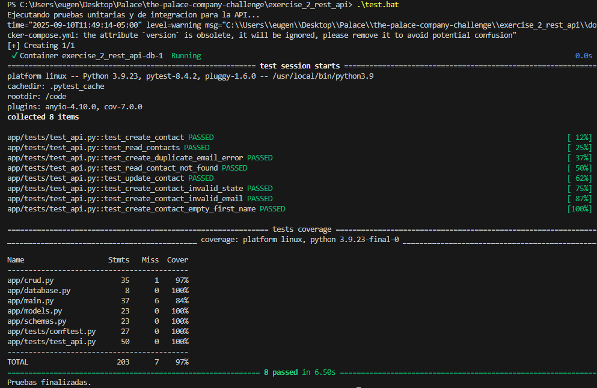
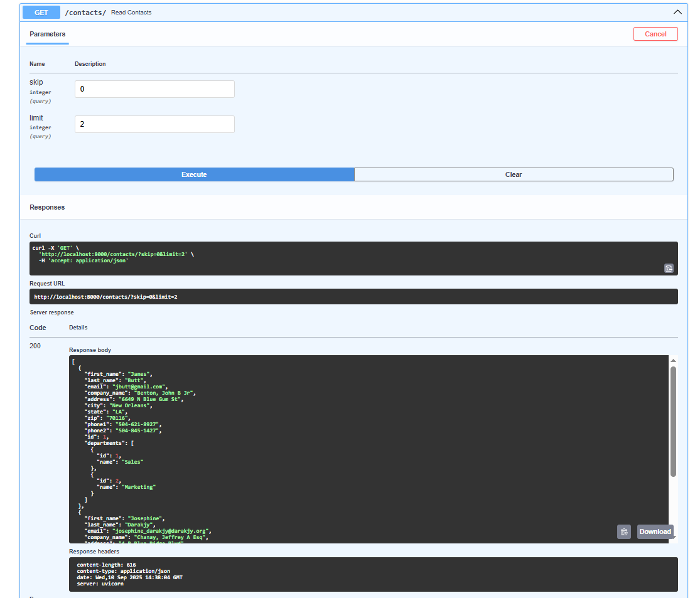
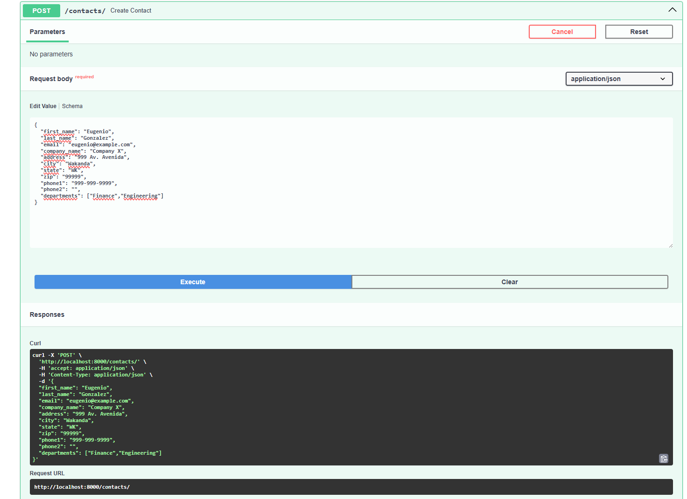
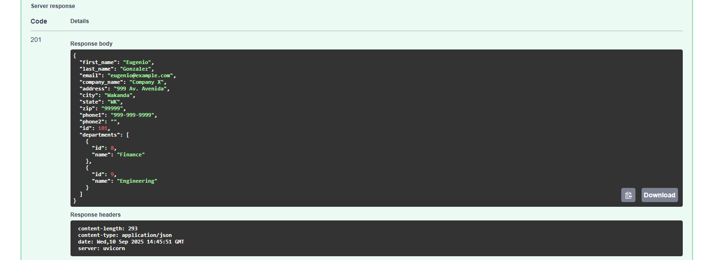
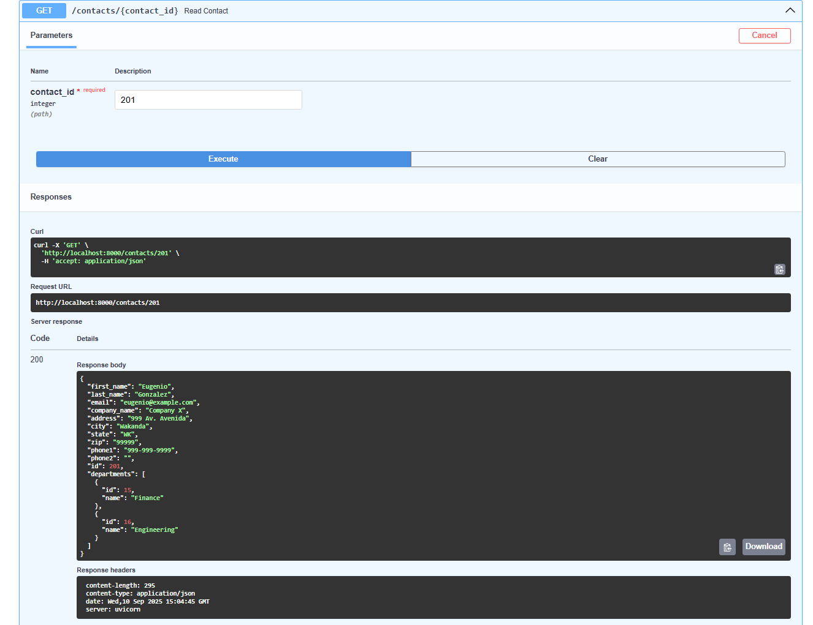
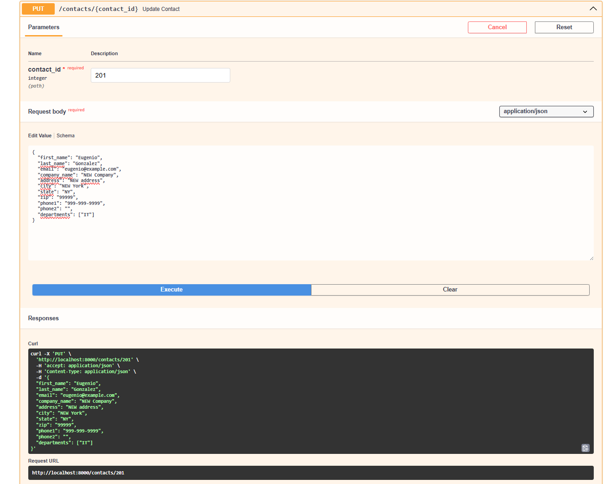
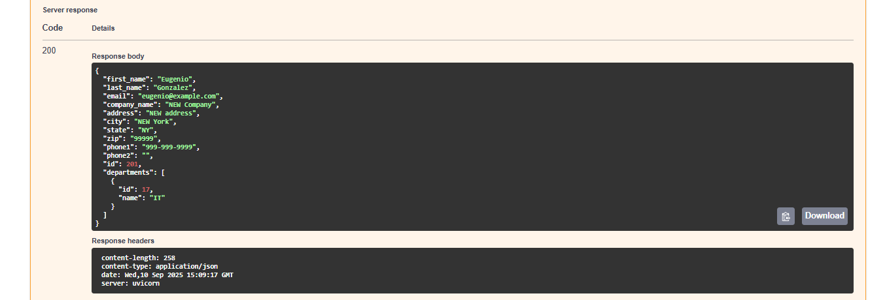

# API de Contactos e Ingesta de Datos

Este proyecto es una solución completa para ingerir datos desde un archivo CSV, almacenarlos en una base de datos PostgreSQL y exponerlos a través de una API RESTful robusta, probada y automatizada.

El sistema está completamente contenedorizado con Docker para garantizar la portabilidad y la reproducibilidad del entorno.

## Características Clave

* **API RESTful:** Desarrollada con FastAPI, ofreciendo alto rendimiento y documentación interactiva automática (Swagger UI).
*   **Base de Datos Relacional:** Esquema diseñado en PostgreSQL utilizando el `email` como identificador único de contacto. Al detectar que una misma persona podía pertenecer a múltiples departamentos en los datos de origen, se implementó una relación **many-to-many** (con una tabla de unión) para modelar esta realidad sin duplicar la información del contacto.
* **Proceso de Ingesta Robusto:** Un script de Python (ETL) que valida, transforma y carga los datos, capaz de manejar condiciones de carrera al esperar a que la base de datos esté lista.
* **Validación de Datos:** Reglas estrictas a nivel de API (con Pydantic) y a nivel de base de datos para garantizar la integridad de los datos.
* **Entorno Contenerizado:** Todos los servicios (API, Base de Datos, Tarea de Ingesta) están definidos en `docker-compose.yml`, permitiendo un levantamiento completo con un solo comando.
* **Suite de Pruebas Automatizadas:** Pruebas de integración para los endpoints de la API utilizando `pytest`, con un reporte de cobertura de código que demuestra la calidad del software.
* **Automatización de Tareas:** Scripts de ayuda (`.sh` y `.bat`) para simplificar el flujo de trabajo de desarrollo, ingesta y pruebas.

## Quick Start

**Requisitos:**
* Docker
* Docker Compose
*   **El servicio de Docker Desktop debe estar corriendo.**

**Instrucciones:**
1.  Clona este repositorio en tu máquina local.
2.  Abre una terminal (CMD, PowerShell o Git Bash en Windows; Terminal en macOS/Linux).
3.  **Navega hasta la raíz de este proyecto**, el directorio `exercise_2_rest_api`. Todos los comandos deben ejecutarse desde esta ubicación.

### 1. Levantar el Entorno

Este comando construirá las imágenes de Docker, iniciará los contenedores de la base de datos (`db`) y la API (`api`), y dejará el sistema listo para recibir datos.

* **Windows (CMD o PowerShell):**
  ```cmd
  .\start.bat
  ```
* **Linux o macOS (Bash/Zsh):**
  ```bash
  ./start.sh
  ```
  *(Si obtienes un error de permisos en Linux/macOS, primero ejecuta: `chmod +x *.sh`)*

### 2. Ingesta de Datos

Una vez que el entorno esté corriendo, ejecuta este script para cargar los datos del archivo `data/sample.csv` en la base de datos.

* **Windows:**
  ```cmd
  .\ingest.bat
  ```
* **Linux o macOS:**
  ```bash
  ./ingest.sh
  ```

### 3. Ejecutar las Pruebas

Para verificar la integridad y el correcto funcionamiento de la API, puedes ejecutar la suite de pruebas automatizadas.

* **Windows:**
  ```cmd
  .\test.bat
  ```
* **Linux o macOS:**
  ```bash
  ./test.sh
  ```



### 4. Detener el Entorno

Para detener y eliminar todos los contenedores asociados al proyecto.

```bash
docker-compose down
```
*(Si también deseas eliminar el volumen de datos de la base de datos, usa `docker-compose down -v`)*

## Cómo Probar la API (Swagger UI)

Una vez que el entorno está corriendo y los datos han sido cargados, puedes interactuar con la API directamente desde tu navegador.

**Accede a:** http://localhost:8000/docs

### 1. Leer la Lista de Contactos (GET /contacts/)

Obtén una lista paginada de todos los contactos.



### 2. Crear un Nuevo Contacto (POST /contacts/)

Añade un nuevo contacto a la base de datos. La API es capaz de crear nuevos departamentos sobre la marcha si no existen.





### 3. Leer un Contacto Específico (GET /contacts/{contact_id})

Obtén los detalles de un solo contacto usando su ID.



### 4. Actualizar un Contacto (PUT /contacts/{contact_id})

Modifica los datos de un contacto existente.





## Decisiones de Diseño y Mejoras Futuras

Este proyecto implementa varias de las funcionalidades opcionales y está preparado para futuras mejoras.

### Gestión del Esquema (Migraciones)

**Implementación Futura:**
El proyecto actualmente no está preparado para usar Alembic para la gestión de migraciones de base de datos. Se utilizaría (`Base.metadata.create_all`) para la creación automática de tablas
* **Inicializar Alembic:** Configurar `alembic.ini` y `env.py` para conectarse a la base de datos y reconocer los modelos de SQLAlchemy.
* **Crear Migraciones:** Usar `alembic revision --autogenerate` para generar scripts de migración basados en los cambios en `api/models.py`.
* **Aplicar Migraciones:** Ejecutar `alembic upgrade head` como un paso explícito del despliegue para crear o actualizar el esquema de la base de datos de forma controlada y versionada.

### Unit Testing

El proyecto incluye una suite de pruebas de integración con `pytest` que verifica todos los endpoints de la API, incluyendo casos de éxito y de validación de errores. Las pruebas se ejecutan contra una base de datos SQLite en memoria para garantizar el aislamiento y la velocidad. El reporte de cobertura de código demuestra una alta calidad y fiabilidad del software.

### CI/CD

Aunque no está implementado, el proyecto está diseñado para integrarse fácilmente en un flujo de CI/CD.

**Estrategia Propuesta (con GitHub Actions):**

* **Activador:** Un push o merge a la rama `main`.
* **Fase de CI (Integración Continua):**
  * Un "job" de GitHub Actions se iniciaría en un runner de Linux.
  * Levantaría los servicios `db` y `api` con `docker-compose`.
  * Ejecutaría la suite de pruebas con el comando `test.sh`.
  * Si las pruebas pasan, construiría las imágenes de Docker de producción para la `api` y el `ingestor`.
  * Publicaría estas imágenes en un registro de contenedores (como Docker Hub, GitHub Container Registry o AWS ECR).
* **Fase de CD (Despliegue Continuo):**
  * *(Opcional, para despliegue automático)* Un segundo "job" se conectaría a un servidor de producción (ej. una instancia EC2 en AWS) vía SSH.
  * Ejecutaría `docker-compose pull` para descargar las nuevas imágenes.
  * Ejecutaría `alembic upgrade head` para aplicar cualquier migración de base de datos pendiente.
  * Finalmente, ejecutaría `docker-compose up -d` para reiniciar los servicios con la nueva versión del código.

Este flujo de trabajo automatizaría por completo el proceso de prueba y despliegue, reduciendo el riesgo de errores manuales y acelerando la entrega de nuevas funcionalidades.