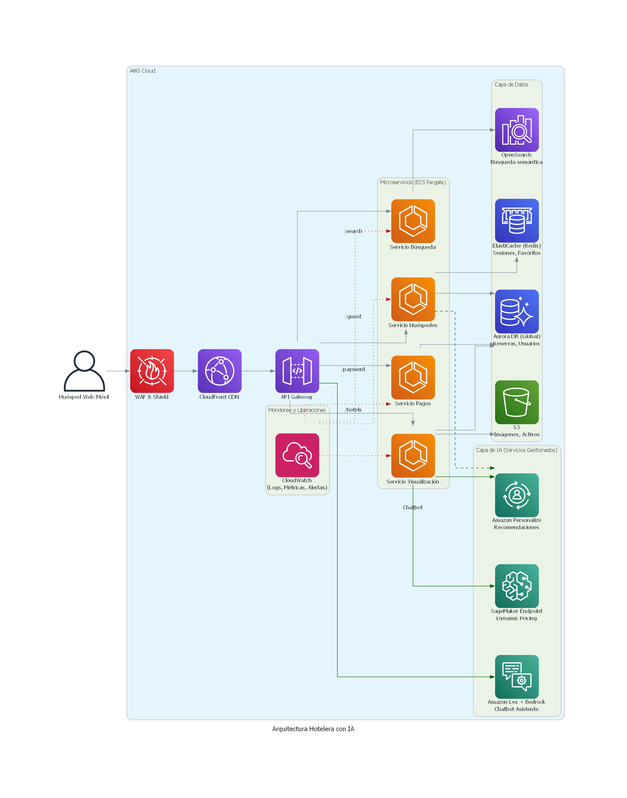

# 🏨 Propuesta de Arquitectura Cloud para Plataforma de Reservas Hoteleras

## 1. Summary

En este documento describimos una arquitectura de microservicios nativa de la nube, utilizando **Amazon Web Services (AWS)**, para la migración y modernización del sitio web de gestión de reservas hoteleras. La arquitectura está diseñada para ser **globalmente rápida**, **segura**, **escalable** y contar con capacidades de **Inteligencia Artificial** para ofrecer una experiencia de usuario superior y optimizar los ingresos del negocio.

## 2. Principios de Diseño

*   **☁️ Nube Nativa:** Uso de servicios gestionados de AWS para minimizar la carga operativa.
*   **🧩 Desacoplamiento:** Microservicios independientes que se pueden desarrollar, desplegar y escalar de forma autónoma.
*   **🚀 Escalabilidad y Elasticidad:** Infraestructura que se adapta automáticamente a la demanda.
*   **🔒 Seguridad por Diseño:** Seguridad integrada en cada capa, desde la red hasta la aplicación.
*   **🤖 Inteligencia Integrada:** Uso proactivo de IA para mejorar la experiencia del cliente y las decisiones de negocio.

## 3. Diagrama de la Arquitectura Propuesta

El siguiente diagrama ilustra la interacción entre los diferentes componentes de la solución, desde la entrada del usuario hasta las capas de datos e inteligencia artificial.

* **Nota**: Este diagrama fue utilizando python diagrams, permite crear diagramas de arquitectura de sistemas en código, en lugar de dibujarlos manualmente.

## 4. Desglose de Componentes

### Capa de Presentación y Entrega (Frontend & Delivery)
*   **Amazon S3:** Aloja los activos estáticos del sitio web (HTML, CSS, JS).
*   **Amazon CloudFront (CDN):** Distribuye el contenido globalmente, almacenándolo en caché cerca de los usuarios para una latencia mínima.
*   **AWS WAF & Shield:** Protege la aplicación contra ataques web comunes (Inyección SQL, XSS).

### API y Lógica de Negocio (Backend)
*   **Amazon API Gateway:** Punto de entrada único y seguro para todas las peticiones. Gestiona la autenticación, autorización y enrutamiento a los microservicios.
*   **AWS Fargate (con ECS):** Motor de cómputo serverless para ejecutar nuestros microservicios en contenedores Docker sin gestionar servidores.
    *   **📦 Servicio de Búsqueda:** Potenciado por OpenSearch, permite búsquedas complejas y semánticas.
    *   **🖼️ Servicio de Visualización:** Entrega los datos de los hoteles (descripciones, precios) desde Aurora y las imágenes desde S3/CloudFront.
    *   **👤 Servicio para Huéspedes:** Gestiona perfiles, favoritos e historial de navegación usando Aurora y ElastiCache para acceso rápido.
    *   **💳 Servicio de Pagos:** Procesa transacciones de forma segura, integrándose con servicios de pago y registrando en Aurora.

### Capa de Datos (Data Layer)
*   **💾 Amazon Aurora (Global Database):** Base de datos relacional principal para datos transaccionales (reservas, usuarios). Garantiza lecturas rápidas para usuarios internacionales.
*   **⚡ Amazon ElastiCache (Redis):** Caché en memoria para datos de acceso frecuente como sesiones y favoritos, reduciendo la carga en la base de datos principal.
*   **🔍 Amazon OpenSearch Service:** Motor de búsqueda para indexar los datos de los hoteles y habilitar búsquedas full-text, geolocalizadas y semánticas (vector search).

### Capa de Inteligencia Artificial (Factor WOW)
*   **🧠 Amazon Personalize:** Ofrece recomendaciones de hoteles personalizadas ("Usuarios como tú también vieron...") basadas en el comportamiento del usuario.
*   **💰 Amazon SageMaker:** Despliega modelos de Machine Learning para implementar *Dynamic Pricing*, ajustando los precios en tiempo real según la demanda y otras variables.
*   **💬 Amazon Lex + Bedrock:** Potencia un chatbot de asistencia 24/7 que responde preguntas frecuentes y ayuda en el proceso de reserva con un lenguaje natural y fluido.
